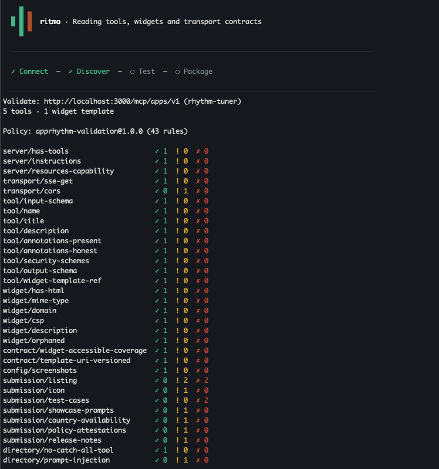

<p align="center">
  <picture>
    <source media="(prefers-color-scheme: dark)" srcset="docs/assets/ritmo-logo-dark.svg">
    <source media="(prefers-color-scheme: light)" srcset="docs/assets/ritmo-logo-light.svg">
    
  </picture>
</p>

<p align="center"><strong>A toolkit for building MCP Apps for ChatGPT and other AI ecosystems</strong></p>

<p align="center"><a href="#start-using-ritmo-in-minutes">Get started</a> · <a href="docs/commands.md">Commands</a> · <a href="docs/simulation.md">Simulator</a> · <a href="docs/authentication.md">Authentication</a> · <a href="CONTRIBUTING.md">Contribute</a></p>

Ritmo is an open-source platform for developing, testing and preparing MCP-powered apps for submission into AI ecosystems (eg, ChatGPT Plugins Directory).

It's a CLI and local browser toolkit that helps prepare MCP supported services for submission to OpenAI for approval in their directory. It will support other AI app ecosystems shortly.

Ritmo is helpful whether you have an existing MCP server that you want to use or are building one to power your AI apps.

With Ritmo you can:
* Validate MCP server tools, metadata and behaviour
* Inspect UI widget status
* Simulate interactions and test scenarios via LLM chat (BYO OpenAI API key)
* Export plugin submission materials

All of this helps you prepare your app for submission to OpenAI.

## Start using Ritmo in minutes!

Get started with the steps below or simply [give Ritmo to your agent](#give-ritmo-to-your-agent) building your MCP-powered app

**Clone down the repo**

```bash
git clone https://github.com/rhythm-labs-inc/ritmo.git
cd ritmo
```


**From the root of this source checkout (Node 22.23.2 or newer)**

```bash
npm ci
npm run build:all
npm link
```

**Connect your app's MCP server**

Switch to your app's project folder. Replace the path and URL below with your own, and keep your MCP server running. No server yet? Try the [included example](docs/demo.md).

```bash
cd /path/to/your-app
ritmo init --server-url "https://your-server.example/mcp" --skip-check
```

This creates `ritmo.yaml` with your server URL and starter app settings.

If your server requires a login or token, follow [MCP authentication](docs/authentication.md) before continuing.

**List your tools and run your first validation**

```bash
ritmo mcp --list-tools
ritmo validate --host chatgpt --no-probe
```

You'll see the tools your server exposes and findings to work through.
<p align="center">
  <a href="docs/assets/validate.png"></a>
</p>

Fix tool and widget issues in your app, then rerun validation. Missing listing details are expected with the starter configuration; you'll complete those below. This first check skips transport probes.

**Try your app in the simulator**

```bash
ritmo auth set-key --provider openai
ritmo simulate --host chatgpt
```

The first command securely saves your OpenAI API key using a hidden prompt; skip it if your key is already configured. Simulation and test runs use your key and incur OpenAI charges.

The simulator opens in your browser. Ask it to do something your app supports, then inspect the answer, tool calls, and any widgets. Try different prompts and, for apps with widgets, light/dark themes and viewport sizes.

<p align="center">
  <a href="docs/assets/simulator.png"></a>
</p>

**Save an interaction as a test and replay it**

After a single-turn interaction, click **Draft smoke test**. Review the prompt and expected tools, check the confirmation box, and click **Save reviewed draft**, keeping the filename `smoke.yaml`. Then stop the simulator with Ctrl+C and run:

```bash
ritmo test --file tests/smoke.yaml --runs 1
```

This reruns the prompt and checks the saved assertions. Add more [test scenarios](docs/config.md#test-suites) for your app's main flows and failure cases. Review answer accuracy and widget behavior yourself as well.

**Complete your submission details and run the final checks**

Fill in the [`app`](docs/config.md#app) and [`submission`](docs/config.md#submission) sections of `ritmo.yaml`: listing copy, icon and screenshot paths, policy/support URLs, showcase prompts, positive and negative test cases, tool justifications, and reviewer notes. Use your deployed MCP URL for the final checks.

```bash
ritmo validate --host chatgpt --fail-on warn
```

This includes transport checks and fails on warnings as well as errors. Resolve the findings, review any skipped checks, and rerun it before exporting.

**Export your submission materials**

When validation and tests are passing, export the submission package.

```bash
ritmo package --out ./submission
ritmo test --file submission/tests/submission.yaml --runs 1
```

The `submission/` folder contains your listing, test cases, tool justifications, skills inventory, availability and policy notes, release notes, and a JSON summary. With submission test cases configured, it also includes `tests/submission.yaml`; the second command replays those generated tool-call checks. Review and strengthen its assertions as needed, and resolve any test failures or missing-material messages before submitting.

Review the exported files alongside your icon and screenshots, test your app in ChatGPT, and use the materials to complete your submission. Ritmo creates local drafts; it does not upload your app or guarantee approval.

Fresh setup uses `ritmo.yaml`, `RITMO_*` settings and `.ritmo/` state. Existing projects and saved credentials remain supported; see the [migration guide](docs/migration.md) for compatibility and upgrade instructions. No unrelated unscoped npm package is needed. For a tarball install and CI recipe, see [installation and verification](docs/installation.md).

## Give Ritmo to your Agent

Working with Claude, Codex, or another coding agent? Copy this prompt into your app's project:

```text
Use Ritmo to help me build and test my MCP-powered app.
Repository: https://github.com/rhythm-labs-inc/ritmo
First read the usage guide: https://github.com/rhythm-labs-inc/ritmo/blob/main/docs/agents.md

Inspect my project and reuse its existing setup. Help me connect my MCP server,
discover its tools, validate the app, fix findings, and test interactions.
Guide me through any missing setup, explain what the results mean, and keep
working toward my app's goal. Follow the guide for credentials and model usage.
```

The [agent guide](docs/agents.md) covers the workflow and links to detailed documentation as needed.
## Basic Ritmo Commands

| Command | What it does |
|---|---|
| `ritmo init --server-url URL` | Create your app's Ritmo configuration with its MCP server URL. |
| `ritmo auth mcp` | Check MCP authentication status; use its options to configure credentials or sign in. |
| `ritmo auth set-key --provider openai` | Securely save your OpenAI API key for simulation and tests. |
| `ritmo mcp --list-tools` | List the tools your MCP server exposes. |
| `ritmo validate --host chatgpt` | Check tools, metadata, widgets, transport, and submission details. |
| `ritmo doctor` | Diagnose MCP connection and transport issues. |
| `ritmo simulate --host chatgpt` | Open the browser simulator to try conversations and widgets. |
| `ritmo widget FILE` | Preview a widget with theme, viewport, and bridge controls. |
| `ritmo test --file FILE` | Replay a test suite and check its assertions. |
| `ritmo package --out ./submission` | Export draft submission materials. |

Replace `URL` and `FILE` with your own values. Add `--help` to any command for its options, or see the [full command reference](docs/commands.md).


## Scope and limits

The toolkit supports MCP Streamable HTTP, the portable MCP Apps bridge, and a partial ChatGPT `window.openai` compatibility shim. It uses its own model prompt and local browser environment. Tool routing, consent, caching, sandbox behavior, and review decisions can differ in production hosts. Test there before release. Commands that call tools can change server data.

## Documentation and community

[Configuration](docs/config.md) · [Authentication](docs/authentication.md) · [Simulation](docs/simulation.md) · [Get help](SUPPORT.md) · [Contributing](CONTRIBUTING.md) · [MIT license](LICENSE)
