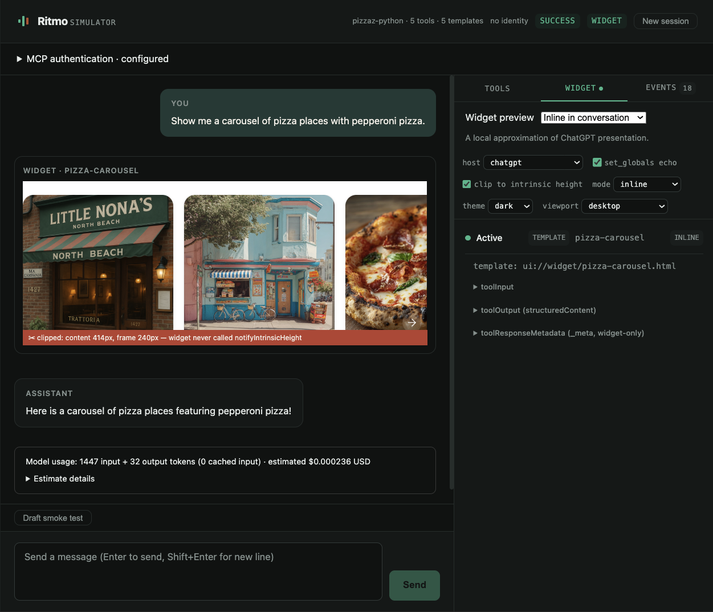

# Simulate and test your app

Use the browser simulator to try conversations, inspect tool calls, and preview widgets. Save useful interactions as tests you can run again.

[](assets/simulator.png)

## Conversation UI with your provider key

**Open the simulator**

From your app's folder, with its MCP server URL saved in `ritmo.yaml`:

```bash
ritmo auth set-key --provider openai
ritmo simulate --host chatgpt
```

The first command saves your OpenAI API key using a hidden prompt. Skip it if the key is already configured. You can also supply `RITMO_OPENAI_API_KEY` through your environment or CI secret manager; a nonempty key there takes precedence over the keychain.

Ask the simulator to do something your app supports. Inspect the answer, tool calls, and any widgets. The **MCP authentication** panel connects to your MCP server; it does not manage the OpenAI model key. See [authentication](authentication.md) if your server needs a login or token.

Simulation uses `gpt-4o-mini` by default. Set `simulate.model` in `ritmo.yaml` to use another available OpenAI Chat Completions model with function tools. Sending prompts and replaying tests incur provider charges and can execute tools on your server.

Use `--host mcp-apps` for the portable MCP Apps bridge. Both profiles approximate host behaviour; test your finished app in its target host too.

**Save a smoke test**

After a single-turn interaction, click **Draft smoke test**. Review the prompt and expected tools, check the confirmation box, and click **Save reviewed draft**. The default file is `tests/smoke.yaml`.

The draft records what happened. Check that it is what you wanted before saving. Add more assertions for arguments, responses, or result contracts using the [test YAML reference](config.md#test-suites).

## Headless and YAML replay

**Replay your saved test**

Stop the simulator with Ctrl+C, or use a second terminal in the same app folder:

```bash
ritmo test --file tests/smoke.yaml --runs 1
```

`--runs N` repeats each case and passes it only when every repetition passes. A failed or errored case makes the command exit 1.

**Run a prompt without opening the browser**

```bash
ritmo simulate --headless --message "Show my open projects"
```

Replace the prompt with something your app supports.

**Save a report for CI**

```bash
ritmo test --file tests/smoke.yaml --reporter junit > results.xml
```

JUnit goes to stdout. Use the command's exit status to decide whether CI passes. Replay uses your model key and your MCP server, so keep test data and permissions appropriate to the tools it can call.

## Standalone widget, no model

**Preview a widget with fixture data**

From the Ritmo source root, try the included example:

```bash
ritmo widget examples/notes/widget.html --data examples/notes/states.json --host mcp-apps
```

Choose notes/empty, light/dark, and desktop/mobile. Inspect bridge events while you interact. Files are watched for changes. Replace the paths with your own HTML and fixture JSON to test your widget.

For a resource served by MCP, pass its `ui://` URI and `--server URL`. Calls use canned results from the fixture when available; otherwise they can reach the configured server.

Use `--no-open` to print the URL without opening a browser, `--no-clip` to disable height clipping, or `--no-echo` to disable state echo. See [widget fixtures](config.md#widget-fixtures) for the data format.

## Answer rendering, sources, and usage

**Review the answer against the tool results**

Assistant messages render Markdown, including lists, tables, and links. Raw HTML is disabled; images show their alt text. Only HTTP(S) links are clickable.

Ritmo asks the model to preserve source titles, URLs, qualifications, and speaker attribution. It also checks for some mismatched links. Widget-only result `_meta` stays out of model messages.

**Known limitation:** answers can still omit qualifications, reverse a source's meaning, or add unsupported claims. Passing a tool test or seeing no link warnings does not verify answer accuracy. Compare important claims with the tool results in the trace.

**Check model usage**

The browser keeps input, cached-input, and output token totals until you reset the session. Headless simulation and tests also report usage. Missing provider usage is shown as incomplete or unavailable.

Cost is an estimate, not a spending limit. The built-in estimate covers standard text tokens for `gpt-4o-mini` and `gpt-4o-mini-2024-07-18`: $0.15 input, $0.075 cached input, and $0.60 output per million tokens. The implementation uses a September 17, 2026 snapshot of [OpenAI's model pricing](https://developers.openai.com/api/docs/models/gpt-4o-mini); these rates were rechecked for the docs on September 22. Other models, service tiers, SDK retries, and billing adjustments may not be represented in the estimate.

## Recheck snippet summaries with a live model

For contributors investigating answer accuracy, the source checkout includes a small evaluation using synthetic excerpts. Read the plan without making model calls:

```bash
node scripts/evaluate-simulator-summaries.mjs
```

To run it with your configured OpenAI key:

```bash
npm run build
node scripts/evaluate-simulator-summaries.mjs --live --runs 3 --out /absolute/new/summary-evaluation
```

This makes paid calls and saves the prompts, source excerpts, answers, usage, and review criteria. It will not overwrite an existing output directory. Review each answer against the source; successful execution means the results are ready to review, not that their meaning is correct.
